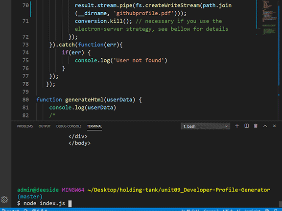

# Node JS Profile generator

Here is a GitHub profile generator made in javascript, Node Js. When run in the command line, user is prompt to enter GitHub username. When entered, axios is uses GitHub API to access username information. When information is returned, a HTML file is created with information and then a converted PDF.

## Always Under Construction 

 1. It was difficult to do, but with help from my tutor, I got an understanding of whats going on with the code. He gave me a clue to  console log a username from github using axios. From there, I was able to see the API information needed. Then slowly it was put together.
 
 2. I tried several things on the stars, stargazers, starred, stargazers_count, but I keep getting undefine? I see a blank array, that should at least give me 0.
 

### Animation, generated HTML, pdf of profiler

### Prerequisites

Any web browser can access or view link, repository. Use Command line or Terminal with Node JS installed to view index.js file.

## Built With
* [HTML](https://developer.mozilla.org/en-US/docs/Web/HTML)
* [CSS](https://developer.mozilla.org/en-US/docs/Web/CSS)
* [NodeJs] (https://nodejs.org/en/about/)
* [NPM] (https://www.npmjs.com/)

## Deployed Link
* No live site, see "Link to Portfolio Site"

## Authors
Dexter Valencia 

- [Link to Portfolio Site](https://github.com/itsmedexter/unit09_Developer-Profile-Generator)
- [Link to Github](https://github.com/itsmedexter)
- [Link to LinkedIn](https://www.linkedin.com/in/dextervalencia/)

## License

This project is licensed under the MIT License 

## Acknowledgments

* Thanks to all for the help.  
